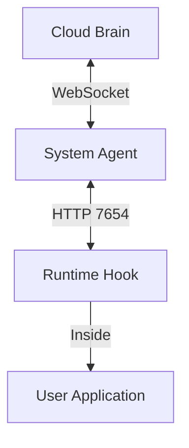

# VulnPkg: Supply Chain Security System

VulnPkg is a production-grade supply chain security system that protects your infrastructure from vulnerable dependencies in real-time. It consists of a centralized **Cloud Brain**, a per-machine **System Agent**, and language-specific **Runtime Hooks**.

## 🏗 Architecture

The system is designed with a "Split Authority" model:
1.  **Cloud Brain**: The source of truth. Ingests CVEs from OSV, manages global state, and pushes alerts to agents via WebSocket.
2.  **System Agent**: The local authority. Runs as a daemon on every machine, maintains a local CVE cache, and enforces policies (e.g., kill process, block network).
3.  **Runtime Hooks**: Lightweight libraries inside your apps that report identity (PID) and inventory to the local Agent.



## 🚀 Quick Start

### Prerequisites
- Node.js v18+
- Redis (optional, for caching)
- Supabase (optional, for persistence)

### 1. Start the Cloud Brain
The Cloud service manages vulnerability data and dashboarding.

```bash
cd cloud
npm install
# Set up .env with SUPABASE_URL/KEY and REDIS_URL if needed
npm start
```
Access the dashboard at [http://localhost:4000/dashboard](http://localhost:4000/dashboard).

### 2. Start the System Agent
The Agent protects the local machine. It listens on port `7654` for local hooks.

```bash
cd agent
npm install
npm link # Install 'vuln-agent' command globally
vuln-agent
```

### 3. Protect an Application
Add the runtime hook to your Node.js application.

```bash
cd your-app
npm install path/to/vuln-pkg/runtime-node # Or npm install vuln-hook-node
```

Add this **as the first import** in your entry file:

```javascript
import "vuln-hook-node";
// ... other imports
```

## 🛡 Features

### 1. Real-time Dashboard ("Hot Visualizations")
- **Live Feed**: See machines registering and alerts firing in real-time.
- **Analytics**: Charts showing vulnerability severity distribution and ecosystem breakdown.
- **Status**: Monitor active agents and critical threats.

### 2. Local Control Plane
The Agent runs a local Express server on `127.0.0.1:7654`.
- **Registration**: Hooks register PIDs and loaded packages.
- **Enforcement**: If a critical CVE is detected (e.g., in `lodash`), the Agent can **KILL** the process immediately based on policy.

### 3. Policy Engine
Configure policies in `agent/config.json`:

```json
{
  "policy": {
    "critical": "kill",
    "high": "block",
    "medium": "alert",
    "low": "log"
  }
}
```

## 🧪 Verification Demo

We have included a `victim-app` that uses a vulnerable version of `lodash` (4.17.15).

1. Ensure Cloud and Agent are running.
2. Run the victim app:
   ```bash
   cd victim-app
   node index.js
   ```
3. Observe the results:
   - The app registers with the Agent.
   - The Agent detects the vulnerability.
   - **The app is killed instantly** (if policy is set to `kill`).
   - The Dashboard updates with the alert.

## 📦 Project Structure

- `cloud/`: Central server (Express, WebSocket, Supabase, Redis).
- `agent/`: Local daemon (Express, WebSocket Client, Enforcement Logic).
- `runtime-node/`: Drop-in hook for Node.js apps.
- `victim-app/`: Proof-of-concept vulnerable application.
