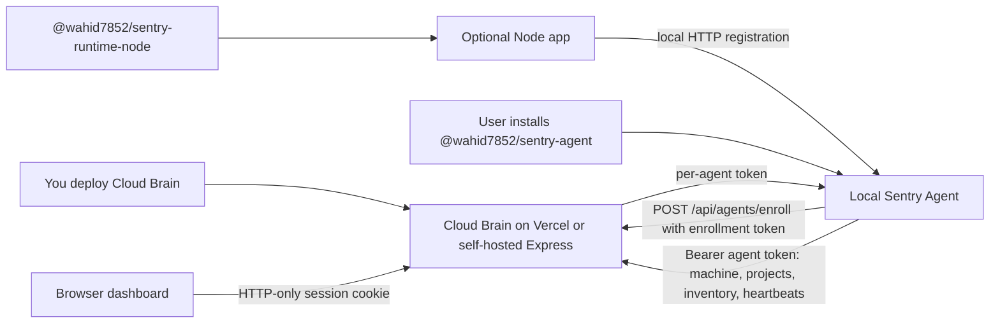

# Sentry Supply Chain Security

Sentry is a three-part supply-chain security system for watching developer machines, discovering projects, exporting package inventory, and surfacing vulnerable dependencies in a hosted Cloud Brain dashboard.

The product path is intentionally simple:

1. You deploy the Cloud Brain once.
2. Users install the global agent package.
3. Users run setup, enter your enrollment token, and choose project folders.
4. The agent keeps machine, project, package, alert, and heartbeat data flowing to the dashboard.
5. Node apps can optionally add the runtime hook for process-aware telemetry.

## Component Docs

- [Cloud Brain](cloud/README.md): hosted dashboard, REST API, Vercel deployment, auth, enrollment, heartbeat, and MongoDB persistence.
- [Sentry Agent](agent/README.md): global npm package, setup wizard, watched roots, passive discovery, automation, Windows startup, and enrollment-token usage.
- [Runtime Node Hook](runtime-node/README.md): optional Node package for PID-aware app registration and runtime events.
- [Victim App](victim-app/README.md): optional vulnerable sample app for local testing.

## Architecture



## The Three Pieces

### 1. Cloud Brain

Cloud Brain is the hosted control plane. It serves the React dashboard, exposes authenticated REST APIs, validates agent enrollment, stores enrolled agents and inventory in MongoDB, and computes dashboard data.

For Vercel deployments, realtime is implemented with HTTP heartbeats from agents plus dashboard polling. The self-hosted Express server can still use WebSockets for long-running local/server deployments.

### 2. Sentry Agent

`@wahid7852/sentry-agent` is the primary package. It is installed globally:

```bash
npm install -g @wahid7852/sentry-agent
sentry-agent setup
```

The agent does not need users to import code into their apps. After setup, it watches configured folders, discovers Node and Python projects by manifest files, computes package inventory, exports snapshots, sends heartbeat status, and rescans automatically.

### 3. Runtime Node Hook

`@wahid7852/sentry-runtime-node` is optional. It is installed inside a Node application only when the user wants runtime/PID-aware registration:

```bash
npm install @wahid7852/sentry-runtime-node
```

Then add this as the first app import:

```js
import "@wahid7852/sentry-runtime-node";
```

The hook talks to the local agent, not directly to the Cloud Brain.

## Hosted Quick Start

### Owner: Deploy the Cloud Brain

1. Create a MongoDB database.
2. Deploy `cloud/` to Vercel.
3. Set these Vercel environment variables:

```bash
MONGODB_URI=mongodb+srv://...
DATABASE_NAME=sentry
PUBLIC_CLOUD_URL=https://your-sentry-cloud.vercel.app
SENTRY_ADMIN_PASSWORD=<long admin password>
SENTRY_SESSION_SECRET=<long random session secret>
SENTRY_ENROLLMENT_TOKEN=<long random invite token>
```

4. Replace the placeholder hosted URL in the agent defaults before publishing:

```text
https://your-sentry-cloud.vercel.app
```

5. Publish the packages in this order:

```bash
cd agent
npm publish --access public

cd ../runtime-node
npm publish --access public
```

### User: Install the Agent

```bash
npm install -g @wahid7852/sentry-agent
sentry-agent setup
```

During setup, the user accepts the hosted Cloud Brain URL, enters your enrollment token, chooses watched project folders, chooses whether to configure Windows startup, and can optionally install the runtime Node hook into detected Node projects.

## How Enrollment Tokens Work

The enrollment token is an invite code for new agents. It is not the long-term machine credential.

1. You set `SENTRY_ENROLLMENT_TOKEN` on the Cloud Brain.
2. A user runs `sentry-agent setup` or `sentry-agent enroll --cloud <url> --token <token>`.
3. The agent sends machine metadata and the enrollment token to `POST /api/agents/enroll`.
4. The Cloud Brain compares the submitted token to `SENTRY_ENROLLMENT_TOKEN`.
5. If valid, the Cloud Brain creates an enrolled-agent record and returns a generated per-agent token.
6. The agent stores that per-agent token in its local config.
7. Future machine registration, package inventory, ingestion, and heartbeat calls use `Authorization: Bearer <agentToken>`.

This gives you two controls:

- Rotate the enrollment token to stop new unknown machines from enrolling.
- Revoke an individual agent token to stop one existing machine without changing every other machine.

Treat the enrollment token like an invite link: share it only with people/devices you want attached to your Cloud Brain.

## Local Development

Install dependencies:

```bash
npm install
cd cloud && npm install
cd ../agent && npm install
cd ../runtime-node && npm install
```

Start the Cloud Brain locally:

```bash
cd cloud
CLOUD_AUTH_REQUIRED=false npm start
```

Start the agent locally:

```bash
cd agent
node index.js start
```

Or from the repo root:

```bash
npm start
```

`start-all.js` starts the Cloud Brain and the local agent for development. The runtime hook is a package, not a background service.

## Automation and Realtime Model

The agent runs several automatic loops after setup:

- Startup scan of watched roots.
- Manifest-change rescans for supported project files.
- Scheduled rescans every five minutes by default.
- HTTP heartbeats every fifteen seconds by default.
- Optional local runtime registrations from Node apps that import the runtime hook.

The Vercel dashboard uses polling plus heartbeat timestamps for online/offline state. A machine is considered online when recent authenticated heartbeats are received.

## Security Defaults

- Public Cloud Brain deployments should require `SENTRY_ADMIN_PASSWORD`, `SENTRY_SESSION_SECRET`, and `SENTRY_ENROLLMENT_TOKEN`.
- Dashboard access uses an HTTP-only session cookie.
- Agent ingestion uses per-agent bearer tokens generated during enrollment.
- Package install does not auto-start services in `postinstall`.
- Users explicitly choose watched folders. The agent avoids whole-disk scanning in v1.
- Runtime integration does not silently edit app entry files.

## Repository Layout

```text
cloud/         Cloud Brain dashboard and API
agent/         Global local agent package
runtime-node/  Optional Node runtime hook package
victim-app/    Optional vulnerable sample app
start-all.js   Local development launcher
```

## Publish Checklist

Before publishing:

```bash
cd cloud && npm run build
cd ../agent && npm pack --dry-run
cd ../runtime-node && npm pack --dry-run
```

Confirm:

- Hosted URL placeholder has been replaced with the real Vercel URL.
- `publishConfig.access` is `public` in both npm packages.
- No `.env`, local config, logs, generated data, or research artifacts are included.
- Cloud Brain has production environment variables configured.
- You have tested `sentry-agent setup` against the hosted Cloud Brain.
